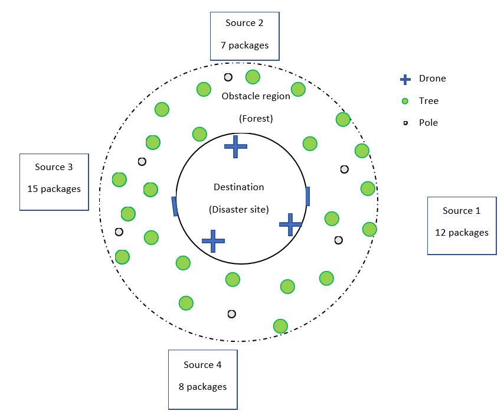
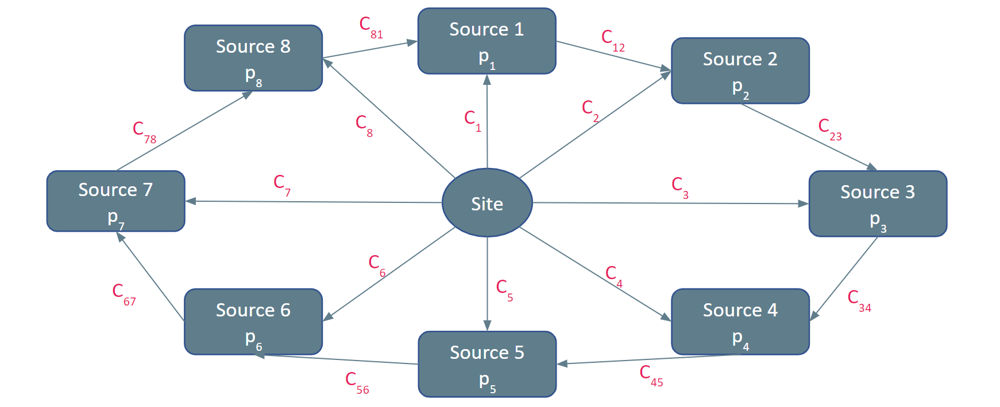

# Planning Algorithm

The agorithm is aimed at planning the motion of a drone swarm for tasks of the following type.

This task is reduced to a graph and the algorithm performs optimal traversal of the following graph

subject to the rules:

1. Each edge traversal incurs a cost and upto *n* edges can be traversed at the same time (where *n* is the number of drones).
2. An edge may be taken by two drones simultaneously with a time gap of 2 s between them. 
3. Sources are classified into window categories (based on proximity to a window) and two sources from the same window category may be taken with a time gap of 2 s.  
4. Each source visit reduces the pi by 4 or brings it to 0 (if pi < 4).
5. If pi for more than one sources is less than 3, inter-source edges may be traversed by incurring the corresponding cost.
6. Each source should be connected to every other source by the shortest path. There is a delay period of 10 s at every source and at the site.
