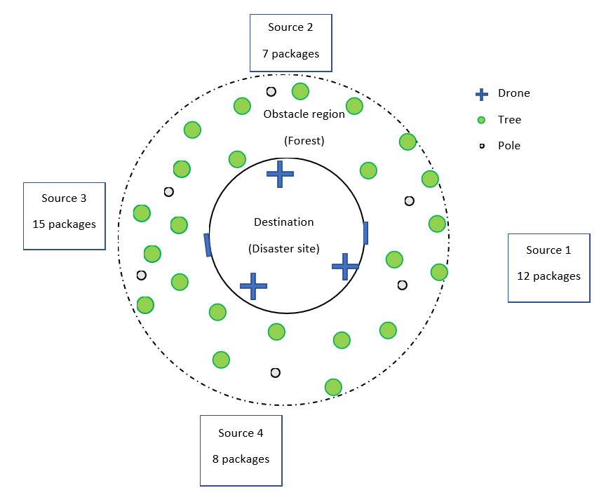

# CPS-Project
Course project for Autonomous Cyber-Physical Systems (CS659A) - Group 14   

This project aims to provide a platform for design, control, and analysis of autonomous drone swarms. It takes a problem environment and task as inputs, calculates the path for each drone in the swarm, and performs optimal multi-agent task assignment. It allows 3-D visualization of the mission in Simulink 3-D animation. Currently, there are separate programs for each component but we plan we integrate everything into a single MATLAB app.   

Below is an illustration of the types of problem targeted by us.

1. Download or clone this repository.
2. Generate an image (single colour) of the problem environment or use the image [Surrounding2.png](https://github.com/Abdul-Hannan-Faruqi/CPS-Project/blob/main/Path%20Planning/Surrounding2.png) in the Path Planning folder
3. Go to Path Planning folder and open `prmcalc.m`
4. Set the grid resolution for the image and the location of the origin. Define the start array (starting position of each drone - one per row) and goal locations for individual goals. Define variables for each drone to source path.
    > If using the default problem defined in 'Surrounding2.png', just run `prmcalc.m`
    > The path of drone `i` to sources N, S, E, W are saved as `pathNi`, `pathSi`, etc.
6. This will save the path for each drone to each source in the defined variables.
7. Now take the mean path length (steps to goal) for each source and create an array of source travel times, say `run_times`
8. Define an array (`packages`) for the number of packcages at each source
9. Go to planning algorithm and call the 'Assign' function defined in `Assign.m` with the following arguments:
  * `m` - Number of sources
  * `run_times` - travel time to each source
  * `packages` - Number of packages at each source
  * `int_time` - inter-source travel time
  * `n` - Number of drones
10. This will return an array `assignment` having `n` columns where each column holds the source number assigned to the corresponding drone in the ith iteration
11. Now, concatenate paths into single array based on the results of the assignment.
    > E.g. If the first column of assignment is
    > 
    >       1
    >       2
    >       .
    >       .
    >       .
    > 
    > Drone 1 goes to source 1 (say N) and then to source 2 (say E). Therefore, concatenate `pathN1` (forward travel), reverse of `pathN1` (return to site), `pathE1` (forward), and reverse of `pathE1` (return to site) to get the total path into a single array (`dr1`)
12.  With the drone paths defined as `dri`, run `TrajGen.m` in 3-D Simulation. This will generate the trajectories as time series to be used in the Simulink model for path visualization.
13.  For the example problem, read the camera orientation matrix `Cam.csv` into the variable `cam` with the following command

        cam = readmatrix('Cam.csv');
        
15. Next run `Cam_gen.m`
16. Finally open `PathVisualization.slx` and run the simulation.
It will display the 3-D simulation with the preset camera angles.
 
