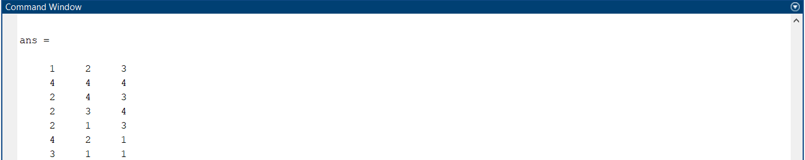

# CPS-Project
Course project for Autonomous Cyber-Physical Systems (CS659A) - Group 14   

This project aims to provide a platform for design, control, and analysis of autonomous drone swarms. It takes a problem environment and the task definition as inputs, calculates the path for each drone in the swarm, and performs optimal multi-agent task assignment. It allows 3-D visualization of the mission in Simulink 3-D animation. Besides, a drone [dynamics model](https://github.com/Abdul-Hannan-Faruqi/CPS-Project/blob/main/DroneModel.slx) is implemented to generate control signals for real-time applications. Currently, there are separate programs for each component but we plan we integrate everything into a single MATLAB app.

Below is an illustration of the types of problem targeted by us.

***

## Requirements
1. MATLAB (This project is entirely based in MATLAB)
2. Simulink 3D Animation (For viewing the 3D Simulations)
    > This can be installed in MATLAB through the Add-On Explorer
    >   * In MATLAB, open the Add-On Explorer from the Home tab, as shown
    >   
    >   * Search for Simulink 3D Animation and install it

## Instructions for use
1. Download or clone this repository.
2. Generate an image (single colour) of the problem environment or use the image [Surrounding2.png](https://github.com/Abdul-Hannan-Faruqi/CPS-Project/blob/main/Path%20Planning/Surrounding2.png) in the Path Planning folder. Coloured aerial photographs with almost uniform ambient background will also work ([example](Illustrations/Seg.png)). For more general cases, use Matlab Image Processing Toolbox to pre-process the image
3. Go to Path Planning folder and open `prmcalc.m`
4. Set the grid resolution for the image and the location of the origin. Define the start array (starting position of each drone - one per row) and goal locations for individual goals. Define variables for each drone to source path.
    > If using the default problem defined in 'Surrounding2.png', just run `prmcalc.m`
    > The path of drone `i` to sources N, S, E, W are saved as `pathNi`, `pathSi`, etc.
5. Run `prmcalc.m`. This will save the path for each drone to each source in the defined variables.
6. Now take the mean path length (steps to goal) for each source and create an array of source travel times, say `run_times`
7. Define an array (`packages`) for the number of packages at each source.
8. Open [3D POINTS](https://github.com/Abdul-Hannan-Faruqi/CPS-Project/tree/main/3-D%20Simulation) ,which consists of test case trace with `prmcalc.m` output for this test case.  
9. Go to Assignment Algorithm/Classes and call the 'Assign' function defined in `Assign.m` with the following arguments:
  * `m` - Number of sources
  * `run_times` - travel time to each source
  * `packages` - Number of packages at each source
  * `int_time` - inter-source travel time
  * `n` - Number of drones
  
  > Pass 0 to int_time to get result without inter-source travel
  > 
  > 
  > 
9. This will return an array `assignment` having `n` columns where each column holds the source number assigned to the corresponding drone in the ith iteration  
    > 
    > 
    > 
    > Sample result from assign function. The first row shows the drone number and the following rows represent the source number to which the drone travels in that iteration
    > 
    > For the example problem 
    >  * run [path_optimal.m](https://github.com/Abdul-Hannan-Faruqi/CPS-Project/blob/main/Path%20Planning/path_optimal.m) to get a 2-D visualization of the path without inter-source travel
    >  * run [energyOptimal.m](https://github.com/Abdul-Hannan-Faruqi/CPS-Project/blob/main/Path%20Planning/energyOptimal.m) to get a 2-D visualization of the path with inter-source travel.
10. Now, concatenate paths into single array based on the results of the assignment.
    > E.g. If the first column of assignment is
    > 
    >       1
    >       2
    >       .
    >       .
    >       .
    > 
    > Drone 1 goes to source 1 (say N) and then to source 2 (say E). Therefore, concatenate `pathN1` (forward travel), reverse of `pathN1` (return to site), `pathE1` (forward), and reverse of `pathE1` (return to site) to get the total path into a single array (`dr1`)
    > 
    > **The final concatenated trajectories (based on the assignment result), for the example problem, are saved in `.csv` files in the [3-D Simulation folder](https://github.com/Abdul-Hannan-Faruqi/CPS-Project/tree/main/3-D%20Simulation), and can be used directly by following the next steps.**
11.  Run `TrajGen.m` in 3-D Simulation folder. This will generate the trajectories as time series to be used in the Simulink model for path visualization (with inter-source travel). It reads drone path data from the corresponding `.csv` file
12. Next run `Cam_gen.m` which reads camera orientations from `Cam.csv` and generates corresponding time series data

*** 
The following steps require **Simulink 3D Animation** Add-on in MATLAB  

13. Finally open `PathVisualization.slx` and run the simulation. It will display the 3-D simulation for intersource travel case with the preset camera viewpoints. Here, you will have the option of 4 viewpoints.
    > The viewpoints appear as untitled_1, 2, 3, 4. The first and default viewpoint corresponds to our camera positions (`View`) that we input to the model and the next three correspond to the 3 drones - these viewpoints move with the drone. You can change the viewpoint to observe the motion of the individual drones (using the toggle arrows at the bottom) as shown below. The current viewpoint name appears at the top left 
    > 
    > 
14. There are 5 files present in the Path Planning folder namely, [trace.m](https://github.com/Abdul-Hannan-Faruqi/CPS-Project/blob/main/3-D%20Simulation/trace.m) (having drone 1 waypoints), [path.m](https://github.com/Abdul-Hannan-Faruqi/CPS-Project/blob/main/3-D%20Simulation/path.m) (having drone 2 waypoints) and [trajectory.m](https://github.com/Abdul-Hannan-Faruqi/CPS-Project/blob/main/3-D%20Simulation/trajectory.m) (having drone 3 waypoints), [Camera.m](https://github.com/Abdul-Hannan-Faruqi/CPS-Project/blob/main/3-D%20Simulation/Camera.m) Camera automatic position feed on Drone Trajectory and [Camera_rotation.m
](https://github.com/Abdul-Hannan-Faruqi/CPS-Project/blob/main/3-D%20Simulation/Camera_rotation.m) Camera automatic orientation feed on Drone Trajectory. Run these files to generate trajectories for without inter-source travel case.
15. Finally open the Simulink Model [SimulinkDroneWorld.slx](https://github.com/Abdul-Hannan-Faruqi/CPS-Project/blob/main/3-D%20Simulation/SimulinkDroneWorld.slx) and run the simulation. It will display the 3-D simulation for without intersource travel case without automatic camera feed.
    
16. Finally Open the Simulink Model [SimulinkDroneWorld_automatic.slx](https://github.com/Abdul-Hannan-Faruqi/CPS-Project/blob/main/3-D%20Simulation/SimulinkDroneWorld_automatic.slx) and run the simulation. It will display the 3-D simulation for without intersource travel case with automatic camera feed. Even in the automatic camera setting, user can change view with the help of mouse.
    > 
    >  
***
### Drone dynamics Model
`DroneModel.slx` file contains a Simulink model prepared considering the Drone Dynamics, Controller, Gust factor according to DJI Mavic Drone Specifications and there are scopes attached to Linear Position, Angular Position, Linear velocity, Angular Velocity, Linear Acceleration, Angular Acceleration, Current and PID Controller. It can be used for parameter tuning and performance monitoring.
